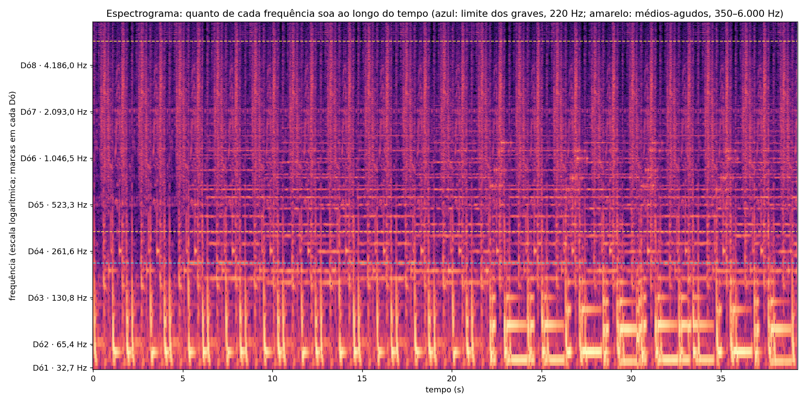
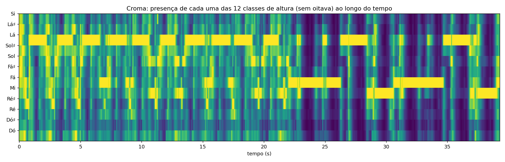

# Leitura do áudio do protótipo

Gerado em 17/09/2026 14:26 por `leitura-audio/ler_audio.py`. Arquivo: `prototipo/audio-prototipo/audio-prototipo.mp3`, 39,3 s, 44100 Hz, lido em mono.

## Como ler este relatório

- As notas seguem a notação científica: Dó4 é o dó central e Lá4 tem 440 Hz. Em parte da tradição brasileira o dó central é chamado Dó3; por isso cada nota vem acompanhada da frequência em Hz, que não tem ambiguidade.
- "c" são cents: centésimos de semitom. +20 c quer dizer um pouco acima da nota; ±50 c fica no meio de duas notas. Nos graves os cents são imprecisos: perto de 55 Hz, 1 Hz de erro já vale ~30 c. Ali, confie no nome da nota, não no desvio.
- Um pico é uma frequência que se destaca no espectro médio do trecho. Pico não é nota tocada: pode ser a fundamental de uma nota ou o harmônico de outra. Quando a frequência é múltiplo de um pico mais grave, a tabela avisa.
- O croma soma as oitavas: mostra quais das 12 notas estão presentes, sem dizer se são graves ou agudas.
- "Acorde provável" é a tríade maior ou menor mais parecida com o croma do trecho. Semelhança abaixo de ~0,75 indica que o trecho não se parece bem com nenhuma tríade simples.
- Instrumentos não são identificados: a mesma faixa de frequência é compartilhada por muitos instrumentos.

## Resumo do trecho inteiro

| Medida | Resultado |
|---|---|
| Tonalidade provável | Lá menor (correlação 0,67); depois Fá maior (0,49) e Lá maior (0,36) |
| Andamento estimado | 117 BPM (pode estar dobrado ou pela metade) |
| Ataques detectados | 248 (6,3 por segundo) |
| Pico mais grave (não harmônico) | 44,3 Hz = Fá1 (F1, +24 c) |
| Pico mais agudo (não harmônico) | 3.586,8 Hz = Lá7 (A7, +33 c) |
| Notas que mais aparecem como pico | Lá1 (15 trechos), Dó4 (14 trechos), Ré5 (9 trechos), Mi5 (7 trechos), Lá5 (6 trechos), Sol4 (5 trechos), Dó5 (4 trechos), Si4 (4 trechos) |

## Trecho a trecho

Trechos de 2,0 s. Energia em dB relativa ao trecho mais forte (0 dB = mais forte). Faixas do fluxo simétrico: graves 30–220 Hz, médios-agudos 350–6.000 Hz.

| Tempo | Nota mais grave com destaque | Classes mais presentes | Acorde provável | Centroide | Graves | Médios-agudos | Ataques |
|---|---|---|---|---|---|---|---|
| 0,0–2,0 s | 55,6 Hz = Lá1 (A1, +20 c) | Lá, Fá, Dó | Fá maior (0,58) | 564,0 Hz | -4 dB | -11 dB | 13 |
| 2,0–4,0 s | 54,0 Hz = Lá1 (A1, -31 c) | Lá, Sol♯, Sol | Fá maior (0,56) | 654,1 Hz | -5 dB | -11 dB | 14 |
| 4,0–6,0 s | 54,4 Hz = Lá1 (A1, -20 c) | Lá, Sol♯, Sol | Fá maior (0,57) | 614,9 Hz | -4 dB | -11 dB | 14 |
| 6,0–8,0 s | 54,9 Hz = Lá1 (A1, -5 c) | Lá, Fá, Sol | Ré menor (0,64) | 528,6 Hz | -4 dB | -11 dB | 13 |
| 8,0–10,0 s | 55,6 Hz = Lá1 (A1, +18 c) | Lá, Fá, Mi | Ré menor (0,63) | 484,0 Hz | -4 dB | -11 dB | 11 |
| 10,0–12,0 s | 54,1 Hz = Lá1 (A1, -28 c) | Sol, Lá, Sol♯ | Mi menor (0,57) | 549,2 Hz | -4 dB | -11 dB | 13 |
| 12,0–14,0 s | 54,5 Hz = Lá1 (A1, -15 c) | Lá, Sol, Sol♯ | Lá menor (0,59) | 557,4 Hz | -4 dB | -11 dB | 12 |
| 14,0–16,0 s | 54,9 Hz = Lá1 (A1, -3 c) | Lá, Fá, Sol | Fá maior (0,61) | 561,1 Hz | -4 dB | -11 dB | 13 |
| 16,0–18,0 s | 55,4 Hz = Lá1 (A1, +14 c) | Lá, Fá, Ré | Ré menor (0,65) | 635,7 Hz | -5 dB | -11 dB | 13 |
| 18,0–20,0 s | 55,3 Hz = Lá1 (A1, +10 c) | Lá, Sol, Mi | Lá menor (0,58) | 586,3 Hz | -4 dB | -11 dB | 11 |
| 20,0–22,0 s | 54,3 Hz = Lá1 (A1, -22 c) | Lá, Sol, Mi | Lá menor (0,58) | 592,0 Hz | -4 dB | -11 dB | 12 |
| 22,0–24,0 s | 44,3 Hz = Fá1 (F1, +27 c) | Fá, Lá, Mi | Fá maior (0,68) | 302,4 Hz | -1 dB | -10 dB | 12 |
| 24,0–26,0 s | 44,3 Hz = Fá1 (F1, +24 c) | Fá, Lá, Mi | Ré menor (0,70) | 346,1 Hz | -1 dB | -10 dB | 13 |
| 26,0–28,0 s | 54,9 Hz = Lá1 (A1, -4 c) | Lá, Fá, Sol♯ | Fá maior (0,68) | 254,3 Hz | +0 dB | -10 dB | 11 |
| 28,0–30,0 s | 54,7 Hz = Lá1 (A1, -9 c) | Mi, Lá, Ré♯ | Lá menor (0,65) | 263,7 Hz | -0 dB | -11 dB | 13 |
| 30,0–32,0 s | 85,8 Hz = Fá2 (F2, -30 c) | Fá, Mi, Lá | Fá maior (0,62) | 299,5 Hz | -1 dB | -10 dB | 13 |
| 32,0–34,0 s | 44,3 Hz = Fá1 (F1, +25 c) | Fá, Lá, Mi | Fá maior (0,71) | 260,2 Hz | -1 dB | -11 dB | 13 |
| 34,0–36,0 s | 54,6 Hz = Lá1 (A1, -12 c) | Lá, Fá, Sol♯ | Fá maior (0,70) | 367,8 Hz | -1 dB | -10 dB | 12 |
| 36,0–38,0 s | 54,9 Hz = Lá1 (A1, -5 c) | Lá, Mi, Sol♯ | Lá menor (0,64) | 318,2 Hz | -1 dB | -10 dB | 13 |
| 38,0–39,3 s | 82,3 Hz = Mi2 (E2, -2 c) | Mi, Sol, Fá | Mi menor (0,69) | 432,6 Hz | -3 dB | -11 dB | 9 |

## Picos de cada trecho

Até 8 picos por trecho, do mais forte ao mais fraco. "Relativo" compara com o pico mais forte do mesmo trecho.

### 0,0–2,0 s

| Frequência | Nota mais próxima | Relativo | Observação |
|---|---|---|---|
| 55,6 Hz | Lá1 (A1, +20 c) | +0 dB |  |
| 263,8 Hz | Dó4 (C4, +14 c) | -15 dB |  |
| 2.752,0 Hz | Fá7 (F7, -26 c) | -24 dB |  |

### 2,0–4,0 s

| Frequência | Nota mais próxima | Relativo | Observação |
|---|---|---|---|
| 54,0 Hz | Lá1 (A1, -31 c) | +0 dB |  |
| 263,9 Hz | Dó4 (C4, +15 c) | -14 dB |  |
| 2.751,6 Hz | Fá7 (F7, -26 c) | -22 dB |  |
| 3.586,8 Hz | Lá7 (A7, +33 c) | -25 dB |  |

### 4,0–6,0 s

| Frequência | Nota mais próxima | Relativo | Observação |
|---|---|---|---|
| 54,4 Hz | Lá1 (A1, -20 c) | +0 dB |  |
| 263,7 Hz | Dó4 (C4, +14 c) | -16 dB |  |
| 524,3 Hz | Dó5 (C5, +3 c) | -23 dB |  |
| 2.751,8 Hz | Fá7 (F7, -26 c) | -24 dB |  |
| 3.585,4 Hz | Lá7 (A7, +32 c) | -27 dB |  |

### 6,0–8,0 s

| Frequência | Nota mais próxima | Relativo | Observação |
|---|---|---|---|
| 54,9 Hz | Lá1 (A1, -5 c) | +0 dB |  |
| 175,0 Hz | Fá3 (F3, +4 c) | -10 dB |  |
| 586,3 Hz | Ré5 (D5, -3 c) | -17 dB |  |
| 878,1 Hz | Lá5 (A5, -4 c) | -17 dB | pode ser o 5º harmônico de 175,0 Hz (Fá3) |
| 440,7 Hz | Lá4 (A4, +3 c) | -17 dB | pode ser o 8º harmônico de 54,9 Hz (Lá1) |
| 659,1 Hz | Mi5 (E5, afinado) | -18 dB |  |
| 1.172,7 Hz | Ré6 (D6, -3 c) | -18 dB | pode ser o 2º harmônico de 586,3 Hz (Ré5) |
| 349,1 Hz | Fá4 (F4, -1 c) | -19 dB | pode ser o 2º harmônico de 175,0 Hz (Fá3) |

### 8,0–10,0 s

| Frequência | Nota mais próxima | Relativo | Observação |
|---|---|---|---|
| 55,6 Hz | Lá1 (A1, +18 c) | +0 dB |  |
| 586,7 Hz | Ré5 (D5, -2 c) | -16 dB |  |
| 1.172,9 Hz | Ré6 (D6, -3 c) | -17 dB | pode ser o 2º harmônico de 586,7 Hz (Ré5) |
| 263,8 Hz | Dó4 (C4, +14 c) | -17 dB |  |
| 440,6 Hz | Lá4 (A4, +2 c) | -19 dB | pode ser o 8º harmônico de 55,6 Hz (Lá1) |
| 659,1 Hz | Mi5 (E5, afinado) | -20 dB |  |
| 876,5 Hz | Lá5 (A5, -7 c) | -20 dB |  |
| 697,9 Hz | Fá5 (F5, -1 c) | -25 dB |  |

### 10,0–12,0 s

| Frequência | Nota mais próxima | Relativo | Observação |
|---|---|---|---|
| 54,1 Hz | Lá1 (A1, -28 c) | +0 dB |  |
| 195,7 Hz | Sol3 (G3, -2 c) | -11 dB |  |
| 329,7 Hz | Mi4 (E4, afinado) | -17 dB |  |
| 585,6 Hz | Ré5 (D5, -5 c) | -18 dB | pode ser o 3º harmônico de 195,7 Hz (Sol3) |
| 659,2 Hz | Mi5 (E5, afinado) | -18 dB | pode ser o 2º harmônico de 329,7 Hz (Mi4) |
| 494,4 Hz | Si4 (B4, +2 c) | -19 dB |  |
| 390,8 Hz | Sol4 (G4, -5 c) | -19 dB | pode ser o 2º harmônico de 195,7 Hz (Sol3) |
| 989,1 Hz | Si5 (B5, +2 c) | -20 dB | pode ser o 3º harmônico de 329,7 Hz (Mi4) |

### 12,0–14,0 s

| Frequência | Nota mais próxima | Relativo | Observação |
|---|---|---|---|
| 54,5 Hz | Lá1 (A1, -15 c) | +0 dB |  |
| 261,5 Hz | Dó4 (C4, -1 c) | -13 dB |  |
| 495,1 Hz | Si4 (B4, +4 c) | -18 dB |  |
| 585,7 Hz | Ré5 (D5, -5 c) | -18 dB |  |
| 390,9 Hz | Sol4 (G4, -5 c) | -18 dB |  |
| 523,0 Hz | Dó5 (C5, -1 c) | -19 dB | pode ser o 2º harmônico de 261,5 Hz (Dó4) |
| 786,2 Hz | Sol5 (G5, +5 c) | -19 dB | pode ser o 3º harmônico de 261,5 Hz (Dó4) |
| 659,2 Hz | Mi5 (E5, afinado) | -21 dB |  |

### 14,0–16,0 s

| Frequência | Nota mais próxima | Relativo | Observação |
|---|---|---|---|
| 54,9 Hz | Lá1 (A1, -3 c) | +0 dB |  |
| 263,4 Hz | Dó4 (C4, +11 c) | -14 dB |  |
| 441,0 Hz | Lá4 (A4, +4 c) | -15 dB | pode ser o 8º harmônico de 54,9 Hz (Lá1) |
| 586,8 Hz | Ré5 (D5, -2 c) | -19 dB |  |
| 879,3 Hz | Lá5 (A5, -1 c) | -19 dB |  |
| 523,1 Hz | Dó5 (C5, afinado) | -19 dB |  |
| 659,3 Hz | Mi5 (E5, afinado) | -19 dB |  |
| 786,4 Hz | Sol5 (G5, +5 c) | -20 dB |  |

### 16,0–18,0 s

| Frequência | Nota mais próxima | Relativo | Observação |
|---|---|---|---|
| 55,4 Hz | Lá1 (A1, +14 c) | +0 dB |  |
| 220,4 Hz | Lá3 (A3, +3 c) | -12 dB | pode ser o 4º harmônico de 55,4 Hz (Lá1) |
| 264,0 Hz | Dó4 (C4, +16 c) | -16 dB |  |
| 440,8 Hz | Lá4 (A4, +3 c) | -16 dB | pode ser o 8º harmônico de 55,4 Hz (Lá1) |
| 587,4 Hz | Ré5 (D5, afinado) | -16 dB |  |
| 348,7 Hz | Fá4 (F4, -3 c) | -18 dB |  |
| 1.173,8 Hz | Ré6 (D6, -1 c) | -18 dB | pode ser o 2º harmônico de 587,4 Hz (Ré5) |
| 878,7 Hz | Lá5 (A5, -3 c) | -18 dB | pode ser o 4º harmônico de 220,4 Hz (Lá3) |

### 18,0–20,0 s

| Frequência | Nota mais próxima | Relativo | Observação |
|---|---|---|---|
| 55,3 Hz | Lá1 (A1, +10 c) | +0 dB |  |
| 195,8 Hz | Sol3 (G3, -2 c) | -10 dB |  |
| 263,8 Hz | Dó4 (C4, +15 c) | -16 dB |  |
| 329,5 Hz | Mi4 (E4, afinado) | -16 dB | pode ser o 6º harmônico de 55,3 Hz (Lá1) |
| 659,0 Hz | Mi5 (E5, -1 c) | -17 dB | pode ser o 2º harmônico de 329,5 Hz (Mi4) |
| 391,2 Hz | Sol4 (G4, -4 c) | -18 dB | pode ser o 7º harmônico de 55,3 Hz (Lá1) |
| 495,1 Hz | Si4 (B4, +4 c) | -19 dB |  |
| 988,3 Hz | Si5 (B5, +1 c) | -20 dB | pode ser o 3º harmônico de 329,5 Hz (Mi4) |

### 20,0–22,0 s

| Frequência | Nota mais próxima | Relativo | Observação |
|---|---|---|---|
| 54,3 Hz | Lá1 (A1, -22 c) | +0 dB |  |
| 263,0 Hz | Dó4 (C4, +9 c) | -15 dB |  |
| 1.172,8 Hz | Ré6 (D6, -3 c) | -17 dB | pode ser o 3º harmônico de 391,7 Hz (Sol4) |
| 391,7 Hz | Sol4 (G4, -1 c) | -17 dB |  |
| 329,3 Hz | Mi4 (E4, -2 c) | -18 dB | pode ser o 6º harmônico de 54,3 Hz (Lá1) |
| 586,8 Hz | Ré5 (D5, -1 c) | -18 dB |  |
| 522,7 Hz | Dó5 (C5, -2 c) | -21 dB |  |
| 783,3 Hz | Sol5 (G5, -2 c) | -21 dB | pode ser o 2º harmônico de 391,7 Hz (Sol4) |

### 22,0–24,0 s

| Frequência | Nota mais próxima | Relativo | Observação |
|---|---|---|---|
| 86,9 Hz | Fá2 (F2, -9 c) | +0 dB | pode ser o 2º harmônico de 44,3 Hz (Fá1) |
| 44,3 Hz | Fá1 (F1, +27 c) | -0 dB |  |
| 130,6 Hz | Dó3 (C3, -2 c) | -11 dB | pode ser o 3º harmônico de 44,3 Hz (Fá1) |
| 1.320,0 Hz | Mi6 (E6, +2 c) | -16 dB | pode ser o 5º harmônico de 263,4 Hz (Dó4) |
| 263,4 Hz | Dó4 (C4, +12 c) | -18 dB | pode ser o 6º harmônico de 44,3 Hz (Fá1) |
| 877,6 Hz | Lá5 (A5, -5 c) | -20 dB |  |
| 1.172,3 Hz | Ré6 (D6, -4 c) | -21 dB |  |
| 440,3 Hz | Lá4 (A4, +1 c) | -21 dB |  |

### 24,0–26,0 s

| Frequência | Nota mais próxima | Relativo | Observação |
|---|---|---|---|
| 44,3 Hz | Fá1 (F1, +24 c) | +0 dB |  |
| 87,1 Hz | Fá2 (F2, -5 c) | -1 dB | pode ser o 2º harmônico de 44,3 Hz (Fá1) |
| 585,6 Hz | Ré5 (D5, -5 c) | -17 dB | pode ser o 2º harmônico de 293,4 Hz (Ré4) |
| 293,4 Hz | Ré4 (D4, -1 c) | -18 dB |  |
| 1.172,6 Hz | Ré6 (D6, -3 c) | -18 dB | pode ser o 4º harmônico de 293,4 Hz (Ré4) |
| 440,4 Hz | Lá4 (A4, +2 c) | -20 dB |  |
| 877,5 Hz | Lá5 (A5, -5 c) | -20 dB |  |
| 658,8 Hz | Mi5 (E5, -1 c) | -21 dB |  |

### 26,0–28,0 s

| Frequência | Nota mais próxima | Relativo | Observação |
|---|---|---|---|
| 54,9 Hz | Lá1 (A1, -4 c) | +0 dB |  |
| 1.173,4 Hz | Ré6 (D6, -2 c) | -22 dB | pode ser o 3º harmônico de 391,7 Hz (Sol4) |
| 264,0 Hz | Dó4 (C4, +16 c) | -22 dB |  |
| 659,4 Hz | Mi5 (E5, afinado) | -23 dB |  |
| 585,9 Hz | Ré5 (D5, -4 c) | -23 dB |  |
| 1.045,5 Hz | Dó6 (C6, -2 c) | -23 dB |  |
| 391,7 Hz | Sol4 (G4, -1 c) | -24 dB |  |
| 495,1 Hz | Si4 (B4, +4 c) | -25 dB |  |

### 28,0–30,0 s

| Frequência | Nota mais próxima | Relativo | Observação |
|---|---|---|---|
| 82,1 Hz | Mi2 (E2, -7 c) | +0 dB |  |
| 54,7 Hz | Lá1 (A1, -9 c) | -0 dB |  |
| 165,0 Hz | Mi3 (E3, +2 c) | -14 dB | pode ser o 3º harmônico de 54,7 Hz (Lá1) |
| 263,3 Hz | Dó4 (C4, +11 c) | -18 dB |  |
| 293,8 Hz | Ré4 (D4, +1 c) | -19 dB |  |
| 659,3 Hz | Mi5 (E5, afinado) | -20 dB | pode ser o 8º harmônico de 82,1 Hz (Mi2) |
| 588,0 Hz | Ré5 (D5, +2 c) | -21 dB | pode ser o 2º harmônico de 293,8 Hz (Ré4) |
| 390,8 Hz | Sol4 (G4, -5 c) | -21 dB |  |

### 30,0–32,0 s

| Frequência | Nota mais próxima | Relativo | Observação |
|---|---|---|---|
| 85,8 Hz | Fá2 (F2, -30 c) | +0 dB |  |
| 262,5 Hz | Dó4 (C4, +5 c) | -15 dB |  |
| 522,4 Hz | Dó5 (C5, -3 c) | -20 dB |  |
| 1.173,0 Hz | Ré6 (D6, -2 c) | -21 dB |  |
| 785,0 Hz | Sol5 (G5, +2 c) | -22 dB | pode ser o 3º harmônico de 262,5 Hz (Dó4) |
| 878,2 Hz | Lá5 (A5, -4 c) | -22 dB |  |
| 697,1 Hz | Fá5 (F5, -3 c) | -23 dB |  |
| 1.319,5 Hz | Mi6 (E6, +1 c) | -24 dB |  |

### 32,0–34,0 s

| Frequência | Nota mais próxima | Relativo | Observação |
|---|---|---|---|
| 44,3 Hz | Fá1 (F1, +25 c) | +0 dB |  |
| 86,8 Hz | Fá2 (F2, -10 c) | -2 dB | pode ser o 2º harmônico de 44,3 Hz (Fá1) |
| 440,4 Hz | Lá4 (A4, +1 c) | -19 dB |  |
| 294,0 Hz | Ré4 (D4, +2 c) | -19 dB |  |
| 263,9 Hz | Dó4 (C4, +15 c) | -20 dB | pode ser o 6º harmônico de 44,3 Hz (Fá1) |
| 586,7 Hz | Ré5 (D5, -2 c) | -22 dB | pode ser o 2º harmônico de 294,0 Hz (Ré4) |
| 349,2 Hz | Fá4 (F4, afinado) | -22 dB | pode ser o 8º harmônico de 44,3 Hz (Fá1) |
| 879,4 Hz | Lá5 (A5, -1 c) | -23 dB | pode ser o 3º harmônico de 294,0 Hz (Ré4) |

### 34,0–36,0 s

| Frequência | Nota mais próxima | Relativo | Observação |
|---|---|---|---|
| 54,6 Hz | Lá1 (A1, -12 c) | +0 dB |  |
| 263,9 Hz | Dó4 (C4, +15 c) | -20 dB |  |
| 1.172,8 Hz | Ré6 (D6, -3 c) | -20 dB | pode ser o 2º harmônico de 587,0 Hz (Ré5) |
| 440,7 Hz | Lá4 (A4, +3 c) | -21 dB | pode ser o 8º harmônico de 54,6 Hz (Lá1) |
| 587,0 Hz | Ré5 (D5, -1 c) | -22 dB |  |
| 659,5 Hz | Mi5 (E5, +1 c) | -23 dB |  |
| 781,3 Hz | Sol5 (G5, -6 c) | -23 dB |  |
| 1.039,6 Hz | Dó6 (C6, -11 c) | -25 dB |  |

### 36,0–38,0 s

| Frequência | Nota mais próxima | Relativo | Observação |
|---|---|---|---|
| 54,9 Hz | Lá1 (A1, -5 c) | +0 dB |  |
| 165,1 Hz | Mi3 (E3, +3 c) | -16 dB | pode ser o 3º harmônico de 54,9 Hz (Lá1) |
| 391,5 Hz | Sol4 (G4, -2 c) | -19 dB |  |
| 586,4 Hz | Ré5 (D5, -3 c) | -20 dB |  |
| 330,0 Hz | Mi4 (E4, +2 c) | -21 dB | pode ser o 6º harmônico de 54,9 Hz (Lá1) |
| 1.172,4 Hz | Ré6 (D6, -3 c) | -23 dB | pode ser o 3º harmônico de 391,5 Hz (Sol4) |
| 494,4 Hz | Si4 (B4, +2 c) | -24 dB | pode ser o 3º harmônico de 165,1 Hz (Mi3) |
| 879,3 Hz | Lá5 (A5, -1 c) | -25 dB |  |

### 38,0–39,3 s

| Frequência | Nota mais próxima | Relativo | Observação |
|---|---|---|---|
| 82,3 Hz | Mi2 (E2, -2 c) | +0 dB |  |
| 195,8 Hz | Sol3 (G3, -2 c) | -13 dB |  |
| 261,5 Hz | Dó4 (C4, -1 c) | -15 dB |  |
| 391,5 Hz | Sol4 (G4, -2 c) | -18 dB | pode ser o 2º harmônico de 195,8 Hz (Sol3) |
| 585,4 Hz | Ré5 (D5, -6 c) | -19 dB | pode ser o 3º harmônico de 195,8 Hz (Sol3) |
| 782,8 Hz | Sol5 (G5, -3 c) | -19 dB | pode ser o 4º harmônico de 195,8 Hz (Sol3) |
| 1.172,6 Hz | Ré6 (D6, -3 c) | -22 dB | pode ser o 6º harmônico de 195,8 Hz (Sol3) |
| 521,8 Hz | Dó5 (C5, -5 c) | -22 dB | pode ser o 2º harmônico de 261,5 Hz (Dó4) |

## Figuras

## Limites

- A gravação é uma mistura: a análise do protótipo aceitou a frequência fundamental em só 0,089 % dos quadros. Por isso aqui se fala em picos e notas prováveis, não em notas tocadas.
- Média de 2 s junta notas que mudam dentro do trecho.
- MP3 a 320 kbps altera pouco as frequências abaixo de ~16 kHz, que são as usadas aqui.
- Tonalidade, acorde e andamento vêm de métodos gerais (perfis de Krumhansl e Kessler, moldes de tríades, rastreador de batidas do librosa) e erram em música modal, atonal ou com acordes estendidos.
- Instrumentos exigem escuta ou um modelo treinado; os números só dizem em que região do espectro há energia.